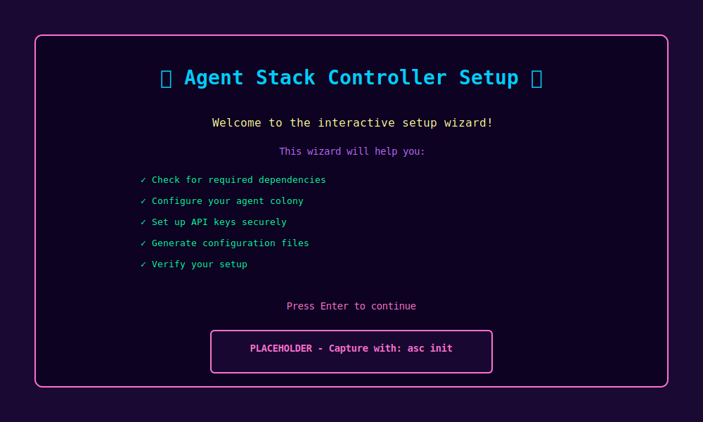
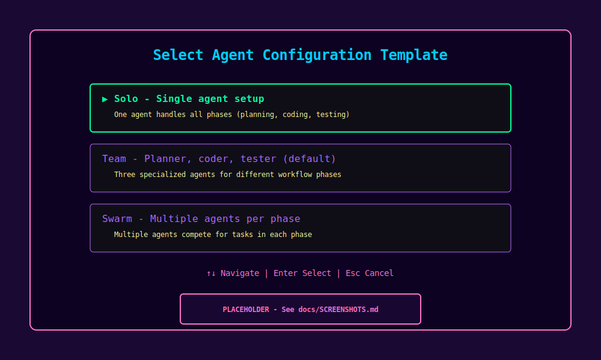
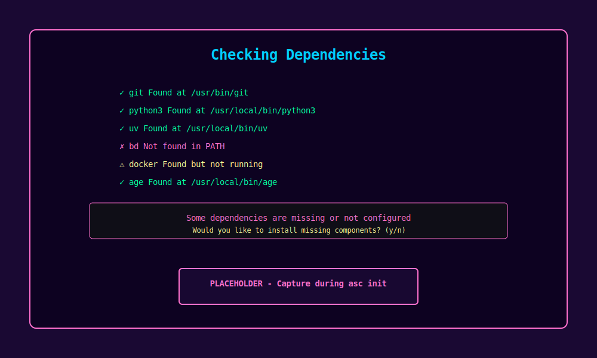
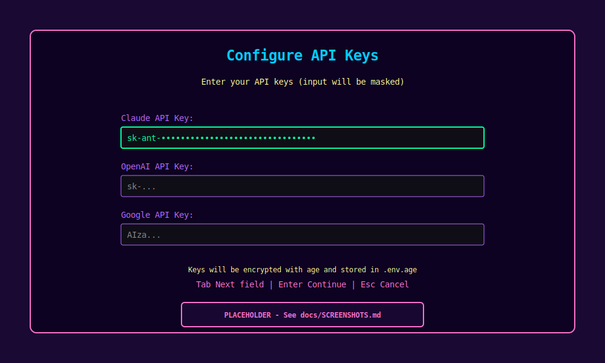
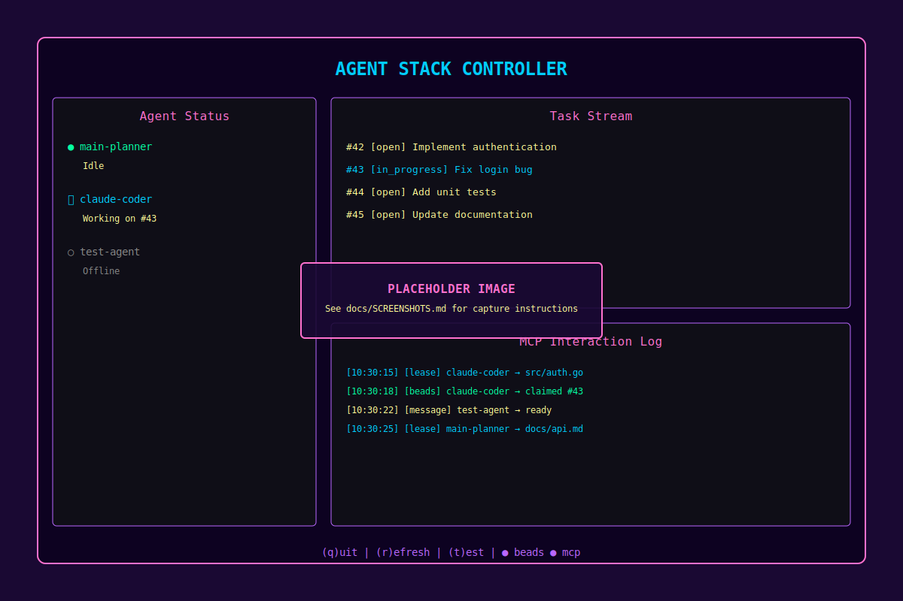
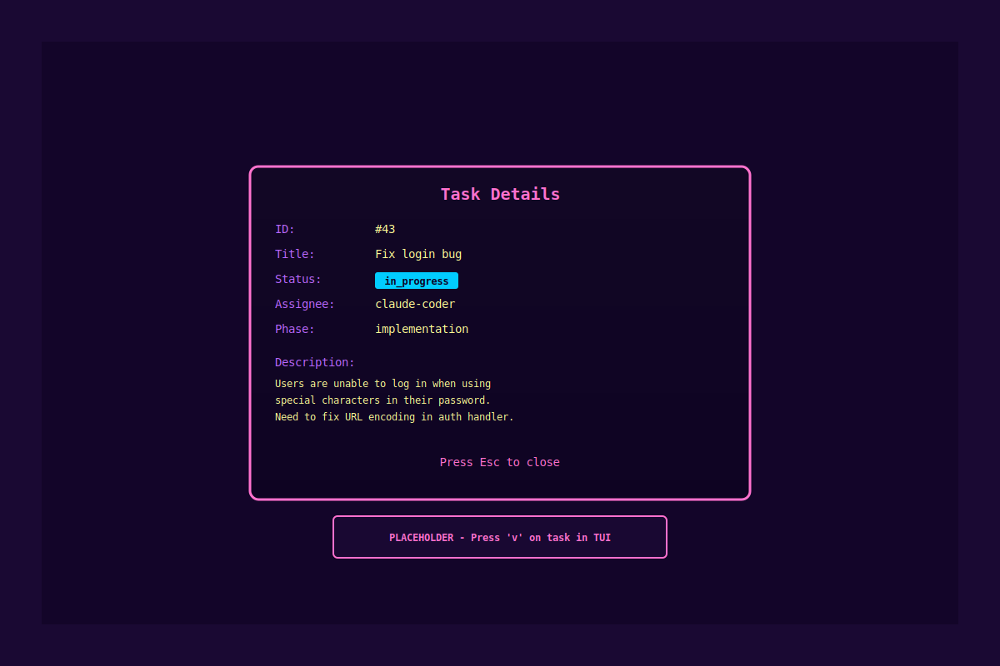
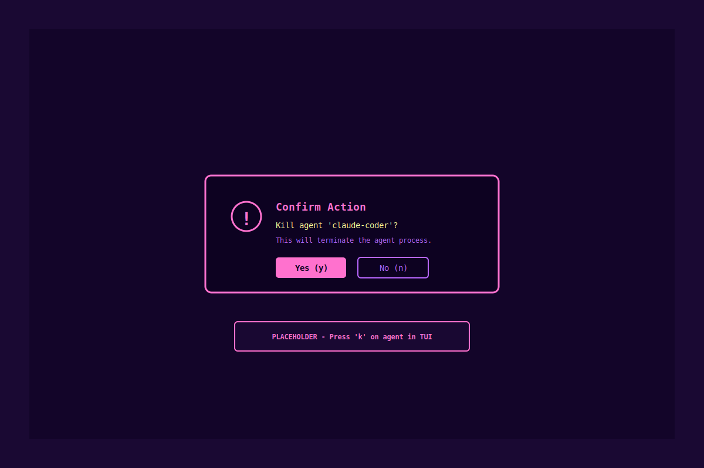
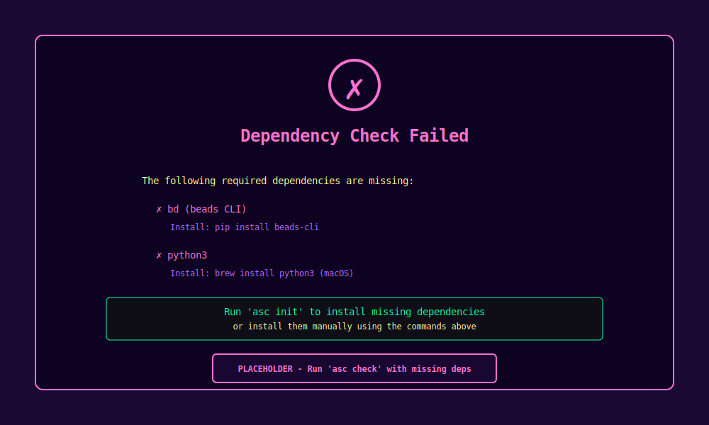
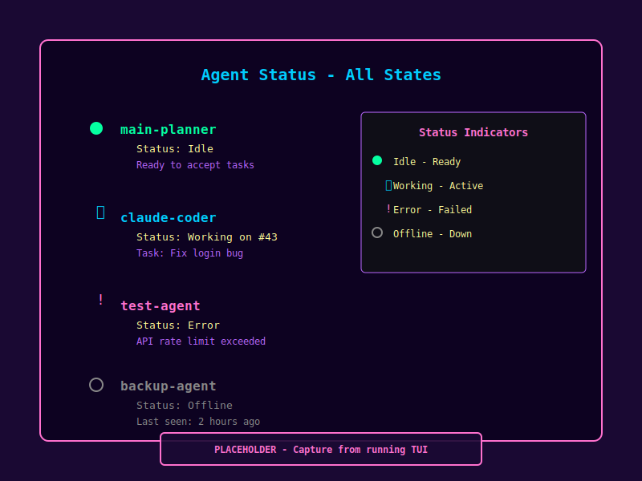
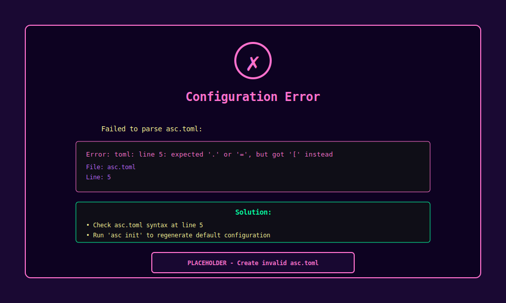

# Agent Stack Controller (asc)

A command-line orchestration tool for managing a local colony of AI coding agents. Think of it as mission control for your headless AI developers.

```
     ┌──────────────────────────────────┐
     │  Agent Stack Controller (asc)    │
     │  - CLI Commands                  │
     │  - TUI Dashboard                 │
     │  - Process Management            │
     └──────────────────────────────────┘
                    │
     ┌──────────────┼──────────────┐
     ▼              ▼              ▼
┌────────┐    ┌────────┐    ┌────────┐
│ Agent  │    │ Agent  │    │ Agent  │
│Planner │    │ Coder  │    │ Tester │
└────────┘    └────────┘    └────────┘
     │              │              │
     └──────────────┼──────────────┘
                    │
     ┌──────────────┴──────────────┐
     ▼                             ▼
┌─────────────┐            ┌──────────────┐
│ mcp_agent_  │            │    beads     │
│    mail     │            │ (Task DB)    │
└─────────────┘            └──────────────┘
```

## Features

- **Single-command orchestration**: Start, stop, and monitor multiple AI agents with simple CLI commands
- **Real-time TUI dashboard**: Beautiful terminal interface showing agent status, task streams, and communication logs
- **Hot-reload configuration**: Add, remove, or update agents without restarting the stack
- **Flexible agent matrix**: Mix and match any LLM (Claude, Gemini, OpenAI) with any role (planner, coder, tester)
- **Git-backed task management**: Integration with beads for persistent, version-controlled task state
- **Asynchronous coordination**: Agents communicate through mcp_agent_mail for file leasing and task coordination
- **Zero-config startup**: Interactive setup wizard handles all dependencies and configuration

## Quick Start

### Installation

#### Option 1: Install via go install (requires Go 1.24+)

The simplest way to install if you have Go installed:

```bash
go install github.com/yourusername/asc@latest
```

This will install the `asc` binary to `$GOPATH/bin` (usually `~/go/bin`). Make sure this directory is in your PATH:

```bash
export PATH=$PATH:$(go env GOPATH)/bin
```

#### Option 2: Build from source (requires Go 1.24+)

Clone the repository and build using the provided Makefile:

```bash
git clone https://github.com/yourusername/asc.git
cd asc

# Build for current platform
make build

# Install to $GOPATH/bin
make install

# Or build for all platforms
make build-all
```

The Makefile provides several useful targets:
- `make build` - Build for current platform
- `make build-all` - Build for all platforms (Linux, macOS Intel, macOS ARM)
- `make install` - Install to $GOPATH/bin
- `make test` - Run all tests
- `make clean` - Remove build artifacts
- `make help` - Show all available targets

#### Option 3: Download pre-built binary

Download the appropriate binary for your platform from the releases page:

```bash
# macOS (Apple Silicon)
curl -L https://github.com/yourusername/asc/releases/latest/download/asc-darwin-arm64 -o asc
chmod +x asc
sudo mv asc /usr/local/bin/

# macOS (Intel)
curl -L https://github.com/yourusername/asc/releases/latest/download/asc-darwin-amd64 -o asc
chmod +x asc
sudo mv asc /usr/local/bin/

# Linux (amd64)
curl -L https://github.com/yourusername/asc/releases/latest/download/asc-linux-amd64 -o asc
chmod +x asc
sudo mv asc /usr/local/bin/
```

Verify the installation:

```bash
asc --version
```

### Initial Setup

Run the interactive setup wizard:

```bash
asc init
```



The wizard will guide you through:

1. **Welcome screen** - Overview of the setup process
2. **Template selection** - Choose from pre-configured agent setups (solo, team, swarm)

   

3. **Dependency checks** - Verify required tools are installed

   

4. **API key configuration** - Securely enter your API keys with masked input

   

5. **Configuration generation** - Create asc.toml and encrypted .env.age files
6. **Health check** - Verify the stack is working correctly

## Usage

### Starting the Agent Stack

Launch all agents and the TUI dashboard:

```bash
asc up
```

This will:
- Start the mcp_agent_mail communication server
- Launch all configured agents as background processes
- Open the interactive TUI dashboard

### TUI Dashboard

Once running, you'll see a three-pane interface with real-time updates:



The dashboard displays:
- **Left pane**: Agent status with color-coded indicators (idle, working, error, offline)
- **Right top pane**: Task stream showing open and in-progress tasks from beads
- **Right bottom pane**: MCP interaction log with real-time agent communication
- **Footer**: Keyboard shortcuts and connection status indicators

#### Keyboard Commands

- `q` - Quit and shut down all agents
- `r` - Force refresh all panes
- `t` - Run health check test
- `v` - View task details in modal (when task is selected)
- `k` - Kill selected agent (with confirmation)
- `↑↓` - Navigate through tasks and agents

#### Interactive Features

The TUI supports interactive modals for detailed information:



Destructive actions require confirmation:



### Stopping the Agent Stack

Gracefully shut down all agents:

```bash
asc down
```

### Health Check

Verify your environment is properly configured:

```bash
asc check
```

Example output:

```
Dependency Check Results:
✓ git          Found at /usr/bin/git
✓ python3      Found at /usr/local/bin/python3
✓ uv           Found at /usr/local/bin/uv
✓ bd           Found at /usr/local/bin/bd
✓ asc.toml     Valid configuration
✓ .env         API keys present
```

If dependencies are missing, you'll see clear error messages:



### Diagnostics and Troubleshooting

Run comprehensive diagnostics to detect and fix common issues:

```bash
# Run diagnostics
asc doctor

# Get detailed information
asc doctor --verbose

# Automatically fix issues
asc doctor --fix

# Output as JSON
asc doctor --json
```

The doctor command checks for:
- Configuration problems
- Corrupted state (PIDs, logs)
- Permission issues
- Resource problems
- Network connectivity
- Agent health issues

Many common issues can be automatically fixed with the `--fix` flag. See [TROUBLESHOOTING.md](TROUBLESHOOTING.md) for more details.

### End-to-End Test

Test the full stack communication:

```bash
asc test
```

This creates a test task in beads, sends a test message through mcp_agent_mail, verifies both systems respond, and cleans up.

### Service Management

Control the mcp_agent_mail server independently:

```bash
# Start the communication server
asc services start

# Check server status
asc services status

# Stop the server
asc services stop
```

## Configuration

### Configuration Templates

asc provides pre-built templates for common agent setups. See [Templates Documentation](docs/TEMPLATES.md) for detailed information.

**Quick start with templates:**

```bash
# List available templates
asc init --list-templates

# Initialize with a template
asc init --template=solo    # Single agent
asc init --template=team    # Planner, coder, tester (default)
asc init --template=swarm   # Multiple agents per phase

# Save your config as a custom template
asc init --save-template my-setup
```

### Configuration File (asc.toml)

The `asc.toml` file defines your agent colony structure:

```toml
[core]
beads_db_path = "./project-repo"

[services.mcp_agent_mail]
start_command = "python -m mcp_agent_mail.server"
url = "http://localhost:8765"

[agent.main-planner]
command = "python agent_adapter.py"
model = "gemini"
phases = ["planning", "design"]

[agent.claude-coder]
command = "python agent_adapter.py"
model = "claude"
phases = ["implementation", "refactor"]

[agent.test-specialist]
command = "python agent_adapter.py"
model = "gpt-4"
phases = ["testing", "validation"]
```

#### Configuration Options

**[core]**
- `beads_db_path` - Path to your beads task database repository

**[services.mcp_agent_mail]**
- `start_command` - Command to start the MCP server
- `url` - HTTP endpoint for the MCP server

**[agent.{name}]**
- `command` - Command to execute the agent process
- `model` - LLM provider: `claude`, `gemini`, `gpt-4`, `codex`
- `phases` - Array of workflow phases this agent handles

### Secure Secrets Management

**IMPORTANT**: Never commit unencrypted API keys to git!

asc uses [age encryption](https://github.com/FiloSottile/age) for automatic, secure secrets management:

#### Initial Setup (Automatic)

```bash
# Run the interactive setup wizard
asc init
```

The wizard will:
1. ✅ Check if age is installed (offers to guide installation)
2. ✅ Generate encryption key automatically
3. ✅ Collect your API keys securely (masked input)
4. ✅ Encrypt secrets automatically
5. ✅ Set up .gitignore to prevent accidents

**That's it!** Your secrets are now encrypted and safe.

#### What Happens Behind the Scenes

```
asc init creates:
  ~/.asc/age.key    → Your encryption key (never commit!)
  .env              → Plaintext secrets (auto-gitignored)
  .env.age          → Encrypted secrets (safe to commit!)
  asc.toml          → Configuration file
```

#### Daily Usage

```bash
# Start agents (automatically decrypts secrets)
asc up

# Update secrets (re-encrypts automatically)
asc secrets encrypt

# Check encryption status
asc secrets status
```

#### Manual Secrets Management (Advanced)

If you need manual control:

```bash
# Decrypt secrets
asc secrets decrypt

# Edit .env with your changes
vim .env

# Re-encrypt
asc secrets encrypt

# Commit encrypted file
git add .env.age
git commit -m "Update secrets"
```

#### Security Best Practices

- ✅ `.env.age` (encrypted) - Safe to commit to git
- ❌ `.env` (plaintext) - NEVER commit (automatically gitignored)
- ✅ `~/.asc/age.key` - Keep safe, backup securely, NEVER commit
- ✅ Use `asc secrets rotate` periodically to rotate encryption keys

The `.env` file is automatically added to `.gitignore` and will have restrictive permissions (0600) set when decrypted.

### Agent Environment Variables

When asc launches agents, it automatically sets these environment variables:

- `AGENT_NAME` - The agent's name from asc.toml
- `AGENT_MODEL` - The LLM model to use
- `AGENT_PHASES` - Comma-separated list of phases
- `MCP_MAIL_URL` - URL of the mcp_agent_mail server
- `BEADS_DB_PATH` - Path to the beads database
- `CLAUDE_API_KEY` - Claude API key (if set)
- `OPENAI_API_KEY` - OpenAI API key (if set)
- `GOOGLE_API_KEY` - Google API key (if set)

## Architecture

### System Layers

asc operates as the orchestration layer (L4) in a multi-layered architecture:

- **L4 (Orchestration)**: asc manages process lifecycle and provides the TUI
- **L3 (Agents)**: Headless Python processes that execute development tasks
- **L1 (Communication)**: mcp_agent_mail handles async agent coordination
- **L0 (State)**: beads provides git-backed task persistence

### Agent Matrix Design

The system supports a matrix architecture where any LLM can fulfill any role:

```
           │ Planning │ Implementation │ Testing │ Refactor │
───────────┼──────────┼────────────────┼─────────┼──────────┤
Claude     │    ✓     │       ✓        │    ✓    │    ✓     │
Gemini     │    ✓     │       ✓        │    ✓    │    ✓     │
GPT-4      │    ✓     │       ✓        │    ✓    │    ✓     │
Codex      │    ✓     │       ✓        │    ✓    │    ✓     │
```

Multiple agents can handle the same phase, competing for tasks based on availability.

## Security

### Secrets Management

asc uses **age encryption** for secure secrets management to prevent accidental exposure of API keys:

**What's Protected:**
- API keys (Claude, OpenAI, Google)
- Environment variables
- Sensitive configuration

**How It Works:**
1. Your secrets are stored in `.env` (plaintext, gitignored)
2. You encrypt them to `.env.age` using your age key
3. Only `.env.age` is committed to git (safe!)
4. Team members decrypt with their own age keys

**Key Management:**
- Your age key is stored in `~/.asc/age.key`
- Never commit this key to git
- Back it up securely (password manager, encrypted backup)
- Share your public key with team members for collaboration
- Rotate keys periodically with `asc secrets rotate`

**Collaboration:**
```bash
# Share your public key with team
asc secrets status  # Shows your public key

# Team member encrypts for you
age -r <your-public-key> -o .env.age .env

# You decrypt with your private key
asc secrets decrypt
```

### File Permissions

asc automatically sets restrictive permissions on sensitive files:
- `.env`: 0600 (owner read/write only)
- `~/.asc/age.key`: 0600 (owner read/write only)
- PID files: 0644 (owner read/write, others read)
- Log files: 0644 (owner read/write, others read)

### Best Practices

1. **Never commit plaintext secrets** - Always use encrypted `.env.age`
2. **Use .gitignore** - Ensure `.env` is gitignored (done automatically)
3. **Rotate keys regularly** - Use `asc secrets rotate` every 90 days
4. **Backup your age key** - Store securely in password manager
5. **Audit access** - Review who has access to encrypted secrets
6. **Use environment-specific files** - `.env.prod.age`, `.env.staging.age`

## Agent Status Indicators

The TUI uses color-coded indicators to show agent states at a glance:



- **● Green** - Agent is idle and ready to accept tasks
- **⟳ Blue** - Agent is actively working on a task
- **! Red** - Agent encountered an error
- **○ Gray** - Agent is offline or not responding

## Error Handling

When configuration errors occur, asc provides clear, actionable error messages:



All errors include:
- Clear description of what went wrong
- File and line number (when applicable)
- Suggested solutions to fix the issue
- Links to relevant documentation

## Troubleshooting

### "Command not found: bd"

The beads CLI is not installed. Install it with:

```bash
pip install beads-cli
# or
uv pip install beads-cli
```

### "Failed to start mcp_agent_mail"

Ensure the mcp_agent_mail package is installed:

```bash
pip install mcp-agent-mail
# or
uv pip install mcp-agent-mail
```

Verify the start command in asc.toml matches your installation.

### "API key not found"

Check that your `.env` file exists and contains the required keys:

```bash
cat .env
```

Ensure the file has proper permissions:

```bash
chmod 600 .env
```

### "Agent stuck in 'Working' state"

An agent may have crashed. Check the logs:

```bash
cat ~/.asc/logs/<agent-name>.log
```

Restart the stack:

```bash
asc down
asc up
```

### "beads database not found"

Ensure the `beads_db_path` in asc.toml points to a valid git repository with beads initialized:

```bash
cd /path/to/project
bd init
```

### "Port already in use"

Another instance of mcp_agent_mail may be running. Stop it:

```bash
asc services stop
# or
pkill -f mcp_agent_mail
```

### TUI not rendering correctly

Ensure your terminal supports 256 colors and has sufficient size:

```bash
echo $TERM  # Should show something like xterm-256color
```

Resize your terminal to at least 80x24 characters.

### Agents not picking up tasks

1. Verify agents are running: Check the Agent Status pane
2. Check task phases match agent configuration
3. Verify beads database is accessible
4. Check agent logs for errors: `~/.asc/logs/<agent-name>.log`

## Development

### Building from Source

```bash
git clone https://github.com/yourusername/asc.git
cd asc

# Build for current platform
make build

# Or use go directly
go build -o asc main.go
```

### Running Tests

```bash
# Run all tests
make test

# Run tests with coverage report
make test-coverage

# Or use go directly
go test ./...
go test -v -race -coverprofile=coverage.out ./...

# Run end-to-end tests (requires build)
make build
go test -tags=e2e ./test -v

# Run comprehensive e2e tests (requires all dependencies)
E2E_FULL=true go test -tags=e2e ./test -v

# Run long-running stability tests
E2E_LONG=true go test -tags=e2e ./test -v -run TestE2ELongRunning -timeout 25h

# Run stress tests
E2E_STRESS=true go test -tags=e2e ./test -v -run TestE2EStress
```

See [test/E2E_TESTING.md](test/E2E_TESTING.md) for comprehensive e2e testing documentation.

### Development Workflow

```bash
# Format code
make fmt

# Run linter
make vet

# Run all checks (format, vet, test)
make check

# Build and run
make run

# Run in development mode with race detector
make dev
```

### Building for Multiple Platforms

```bash
# Build for all platforms (Linux, macOS Intel, macOS ARM)
make build-all

# Binaries will be in build/ directory:
# - build/asc-darwin-amd64
# - build/asc-darwin-arm64
# - build/asc-linux-amd64

# Or build manually for specific platforms
GOOS=linux GOARCH=amd64 go build -o asc-linux-amd64
GOOS=darwin GOARCH=amd64 go build -o asc-darwin-amd64
GOOS=darwin GOARCH=arm64 go build -o asc-darwin-arm64
```

### Makefile Targets

Run `make help` to see all available targets:

```
make build       - Build the binary for current platform
make build-all   - Build binaries for all platforms
make test        - Run all tests
make install     - Install to $GOPATH/bin
make clean       - Remove build artifacts
make deps        - Download dependencies
make tidy        - Tidy and verify dependencies
make fmt         - Format Go code
make vet         - Run go vet
make lint        - Run golangci-lint
make check       - Run all checks (fmt, vet, test)
make release     - Prepare a release (build all platforms, run tests)
```

## Project Structure

```
asc/
├── cmd/                    # CLI command implementations
│   ├── root.go            # Root command and global flags
│   ├── init.go            # Interactive setup wizard
│   ├── up.go              # Start agents and TUI
│   ├── down.go            # Stop all agents
│   ├── check.go           # Dependency verification
│   ├── test.go            # End-to-end health check
│   └── services.go        # Service management
├── internal/
│   ├── config/            # Configuration parsing
│   ├── process/           # Process lifecycle management
│   ├── check/             # Dependency checking
│   ├── tui/               # Bubbletea TUI components
│   ├── beads/             # Beads database client
│   ├── mcp/               # MCP agent mail client
│   ├── logger/            # Logging utilities
│   └── errors/            # Error handling
├── asc.toml               # Configuration file
├── .env                   # API keys (gitignored)
└── main.go                # Entry point
```

## Dependencies

### Required

- **Go 1.24+** (for building from source)
- **git** - Version control
- **python3** - For running agents
- **beads (bd)** - Task database CLI
- **mcp_agent_mail** - Agent communication server

### Optional

- **uv** - Fast Python package manager
- **docker** - For containerized agent execution (optional, see [Docker Setup](#docker-setup))

## Docker Setup

Docker is an optional dependency that enables containerized agent execution. This can be useful for:

- Isolating agent environments
- Running agents with specific dependencies
- Testing agents in clean environments
- Deploying agents to container orchestration platforms

### Installation

#### macOS

```bash
# Using Homebrew
brew install --cask docker

# Or download Docker Desktop from:
# https://www.docker.com/products/docker-desktop
```

After installation, start Docker Desktop from Applications or run:

```bash
open -a Docker
```

Wait for Docker to start (you'll see the Docker icon in your menu bar), then verify:

```bash
docker --version
docker ps
```

#### Linux

```bash
# Ubuntu/Debian
curl -fsSL https://get.docker.com -o get-docker.sh
sudo sh get-docker.sh
sudo usermod -aG docker $USER

# Fedora/RHEL
sudo dnf install docker
sudo systemctl start docker
sudo systemctl enable docker
sudo usermod -aG docker $USER

# Verify installation
docker --version
docker ps
```

**Note:** You may need to log out and back in for group membership changes to take effect.

#### Windows

Download and install Docker Desktop from:
https://www.docker.com/products/docker-desktop

After installation, verify in PowerShell or Command Prompt:

```powershell
docker --version
docker ps
```

### Verification

Run the `asc check` command to verify Docker is properly installed:

```bash
asc check
```

Docker will show as:
- **✓ PASS** if installed and running
- **⚠ WARN** if not installed (optional dependency)

### Using Docker with asc

Docker support is currently optional and not required for basic agent operation. Future features may include:

- Containerized agent execution
- Docker-based agent templates
- Container orchestration integration
- Isolated agent environments

For now, agents run as native processes on your system. Docker is checked during `asc check` but is not required for operation.

### Testing Docker Installation

To verify Docker is working correctly, run the hello-world container:

```bash
docker run --rm hello-world
```

You should see output confirming Docker is working:
```
Hello from Docker!
This message shows that your installation appears to be working correctly.
```

### Troubleshooting

**Docker command not found:**
- Ensure Docker Desktop is running (macOS/Windows)
- Check that `/usr/local/bin/docker` exists and is in your PATH
- Restart your terminal after installation

**Permission denied:**
- Linux: Ensure your user is in the `docker` group: `sudo usermod -aG docker $USER`
- Log out and back in for changes to take effect

**Docker daemon not running:**
- macOS/Windows: Start Docker Desktop application
- Linux: `sudo systemctl start docker`

For more help, see the [Docker documentation](https://docs.docker.com/).

## Documentation

Comprehensive documentation is available in the `docs/` directory:

- **[Documentation Index](docs/INDEX.md)** - Complete documentation index with all guides
- **[Documentation Overview](docs/README.md)** - Documentation guide and standards
- **[Configuration Guide](docs/CONFIGURATION.md)** - Configuration reference
- **[API Reference](docs/API_REFERENCE.md)** - API documentation
- **[Code Examples](docs/CODE_EXAMPLES.md)** - Practical code examples
- **[FAQ](docs/FAQ.md)** - Frequently asked questions
- **[Operators Handbook](docs/OPERATORS_HANDBOOK.md)** - Operations guide
- **[Security](docs/security/)** - Security features and best practices
- **[Testing](docs/testing/)** - Test reports and coverage
- **[Agent Adapter](agent/README.md)** - Python agent framework documentation
- **[Screenshot Guide](docs/SCREENSHOTS.md)** - Guide for capturing and updating screenshots

### Quick Links

- [Requirements](/.kiro/specs/agent-stack-controller/requirements.md) - System requirements
- [Design](/.kiro/specs/agent-stack-controller/design.md) - Architecture and design
- [Tasks](/.kiro/specs/agent-stack-controller/tasks.md) - Implementation tasks
- [Agent Validation](agent/VALIDATION.md) - Agent implementation validation

### Screenshots

All screenshots in this README are placeholders (SVG format) that need to be replaced with actual terminal captures. See [docs/SCREENSHOTS.md](docs/SCREENSHOTS.md) for detailed instructions on capturing and optimizing screenshots. The placeholder images show the expected layout and content but should be replaced with real captures of the running application.

## Contributing

Contributions are welcome! We have comprehensive guides to help you get started:

- **[Contributing Guide](CONTRIBUTING.md)** - Complete guide to contributing
- **[Code Review Checklist](CODE_REVIEW_CHECKLIST.md)** - What reviewers look for
- **[Testing Best Practices](TESTING.md)** - How to write good tests
- **[Debugging Guide](DEBUGGING.md)** - Tools and techniques for debugging
- **[Troubleshooting](TROUBLESHOOTING.md)** - Solutions to common issues

Quick start:

1. Fork the repository
2. Create a feature branch (`git checkout -b feature/amazing-feature`)
3. Make your changes
4. Add tests for new functionality
5. Run checks (`make check`)
6. Update documentation as needed
7. Submit a pull request

See [Documentation Guidelines](docs/README.md#documentation-guidelines) for documentation standards.

## License

MIT License - see LICENSE file for details

## Acknowledgments

- Built with [Cobra](https://github.com/spf13/cobra) for CLI
- TUI powered by [Bubbletea](https://github.com/charmbracelet/bubbletea)
- Styling with [Lipgloss](https://github.com/charmbracelet/lipgloss)
- Integrates with [beads](https://github.com/steveyegge/beads) task management
- Uses [mcp_agent_mail](https://github.com/Dicklesworthstone/mcp_agent_mail) for coordination

## Support

- Report issues: https://github.com/yourusername/asc/issues
- Documentation: https://github.com/yourusername/asc/wiki
- Discussions: https://github.com/yourusername/asc/discussions
